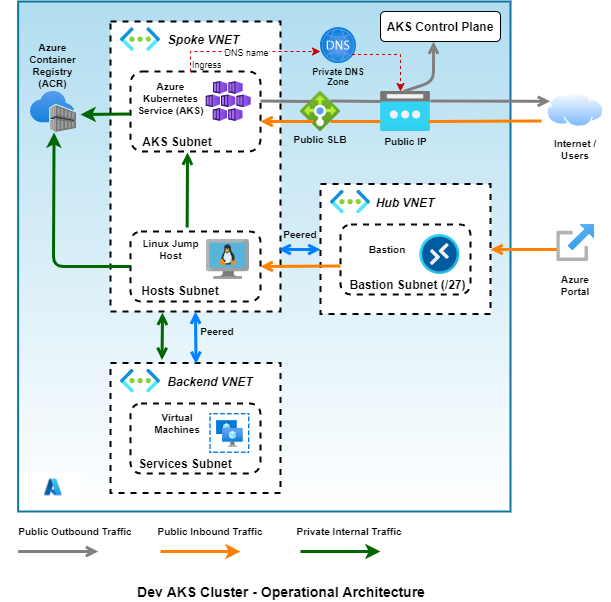

#  Reference Architectures for Azure Kubernetes Services (AKS) Developoment Cluster
This repository contains IaaC deployment artifacts for deploying an AKS cluster for development regions/environments..

**Architecture Blueprint**



## A. Deploy the resources in the blueprint architecture using Azure CLI

1. Use [Azure cloud shell](https://shell.azure.com) or a terminal emulator and login to Azure with your credentials.

2. Clone this GitHub repository to your local machine (or Azure VM)

3. Review and update the **deployment** script

   Review `./dev-cluster/azure-cli/deploy.sh` shell script and update variables with appropriate values (as needed).

4. Review and update the Linux Jumpbox/VM **tools installation** script

   Review `./dev-cluster/azure-cli/install-script.sh`. (Optional) Add commands to install additional tools/utilities on the Linux VM.

4. Run the deployment script

   Finally, run the deployment script to provision the blueprint architecture.

   ```bash
   $ ./dev-cluster/azure-cli/deploy.sh
   ```

5. Review Azure resources

   Login to [Azure Portal](https://portal.azure.com) and verify all Azure resources have been provisioned ok.

   Use [Azure Cloud Shell](https://shell.azure.com) and SSH login to the Linux Jumpbox. Verify Azure CLI, Kubernetes CLI and Helm CLI have been installed on the machine.  See commands below.

   ```bash
   # Verify Azure CLI is installed
   $ az --version
   #
   # Verify Kubernetes CLI is installed
   $ kubectl version
   #
   # Verify Helm CLI is installed
   $ helm version
   #
   # (Optional) Any additional tools which you might have installed ...
   #
   ```
